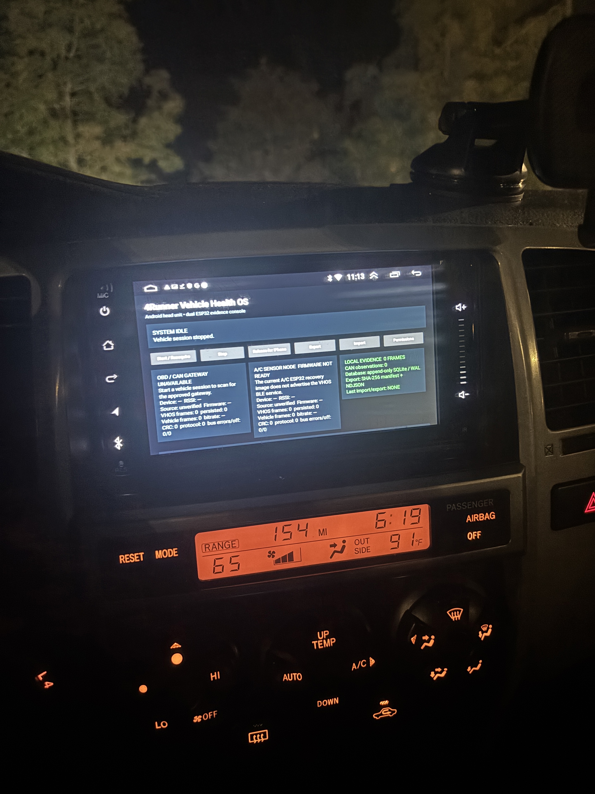

# 4Runner VHOS Android head unit

## Install on the head unit

### [DOWNLOAD VEHICLE HEALTH OS FOR ANDROID (.APK)](https://github.com/IsaiahDupree/4runner-vhos-android/releases/download/android-v0.1.0-dev.13/app-debug.apk)

Current public development build: **0.1.0-dev.13** (`app-debug.apk`, 10,855,119 bytes; SHA-256
`2fb488ccdf8a6e4dff8606602a81f032cb36a3c61fe0a6a86247ed7974f7e3b2`). The link above
downloads the installer directly and does not require a GitHub account.

This release adds a landscape Discovery Engineering workspace
backed by current validated gateway state and the encrypted evidence store: vehicle/source-scoped overview, supported
standard values, 15 versioned test procedures, durable capture drafts and event markers, candidate
review, a closed promotion registry, evidence progress, and production-path replay. Capture, marker,
test, capability-save, and normal completion controls require a fresh validated gateway-health
`PARKED` report and retain the exact authorizing health-frame lineage;
each mutation re-reads the latest synchronous runtime state rather than trusting a delayed UI render,
and live bus status requires a fresh validated `RAW_CAN_FRAME` receipt rather than a cumulative counter;
unknown, moving, stale, and degraded states fail closed. Android operational records remain
explicitly separate from the portable iPhone contracts until a checksummed archive mapping exists.

While the vehicle is parked:

1. Tap **DOWNLOAD VEHICLE HEALTH OS FOR ANDROID (.APK)** above.
2. Approve the browser download, then open `app-debug.apk` from Downloads or the notification.
3. If Android asks, allow this browser to **Install unknown apps**.
4. Tap **Install**, then **Open**.

[Open the public Release Hub](https://isaiahdupree.github.io/4runner-vhos-release-hub/) ·
[View release details and checksum](https://github.com/IsaiahDupree/4runner-vhos-android/releases/tag/android-v0.1.0-dev.13)

## Installed in the 4Runner

<p align="center">
  
</p>

The Android head-unit app running in the vehicle with its independent OBD/CAN, A/C sensor-node,
and local evidence states visible.

Native Android client for the 4Runner Vehicle Health OS. It is deliberately separate from the
[OBD/CAN firmware](https://github.com/IsaiahDupree/4runner-vhos-firmware), the
[A/C telemetry node](https://github.com/IsaiahDupree/4runner-ac-telemetry-node), and the
[iPhone/product repository](https://github.com/IsaiahDupree/4runner-vehicle-health-os), while using
their versioned transport and evidence contracts.

The first vertical slice provides:

- service-filtered BLE discovery for VHOS gateways;
- independent OBD/CAN and A/C device state;
- exact 36-byte `VHOS` frame validation with header and payload CRC32C;
- encrypted GATT notification subscription before handshake negotiation;
- append-only local storage for validated raw logical frames and CAN observations, including
  transactional materialization of CRC-valid persistent capture records;
- a versioned CAN Discovery dashboard for acquisition facts, sampled coverage, raw activity,
  candidate checksum families, repeated channels, and correlations without speculative vehicle labels;
- a SHA-pinned **UNVERIFIED CROSS-MODEL HYPOTHESIS** research surface that evaluates retained
  listen-only bytes while keeping production display, automatic promotion, and digital-twin writes blocked;
- a ranked **NEXT VALIDATION MISSIONS** surface that converts real target activity and source
  lineage into the next controlled experiment without treating research priority as signal confidence;
- a three-pane **DISCOVERY ENGINEERING** workspace with real persisted overview, versioned test
  library, immutable-start capture drafts, synchronized event/measurement markers, Candidate Inbox,
  closed Signal Registry, progress counts, and Replay Lab;
- a centralized engineering safety gate that requires a current validated gateway-health `PARKED`
  report, retains its source/sequence/monotonic lineage, and rejects unknown, moving, stale, future,
  degraded, speed-zero, and owner-asserted states;
- a read-only **HISTORICAL REPLAY • NOT LIVE** surface that replays persisted real CAN evidence
  through the production envelope/stream/CAN decoders at source time or full-speed ×20 load;
- self-resynchronizing frame decoding with explicit corruption, discarded-byte, and recovery
  counters plus automated fragment-loss, payload-corruption, disconnect, cancellation, and soak tests;
- an on-device **OFFLINE LINK RELIABILITY LAB • NOT LIVE** covering MTU 23/churn, bursts, stalls,
  duplicates, fragment loss/corruption/reordering, stale link epochs, reconnects, modeled
  supervision timeout, bounded queue overrun, and mixed interference against saved real evidence;
- passive SAE J1979 Mode 01 response decoding, per-ECU supported-PID continuation tracking, and
  pinned standard read-only values that remain unavailable until support is proven;
- real gateway, protocol, frame, error, and freshness indicators;
- automatic head-unit hardware/runtime/deployment inventory;
- an append-only `toyota.4runner.2005` configuration profile with a V6 timing-chain / V8
  timing-belt applicability guard;
- a 22-system whole-vehicle health map that begins entirely `UNKNOWN / UNKNOWN` and requires
  immutable evidence before showing any health state;
- non-destructive SQLCipher schema migrations through v5, including immutable
  vehicle/profile/source bindings on raw logical/CAN evidence, scoped Android-internal Discovery
  captures/markers/capability observations, fail-closed legacy quarantine, and owner-controlled
  versioned digital-twin JSON export;
- SQLCipher page encryption with a Keystore-wrapped random database passphrase, deterministic
  interrupted-migration recovery, and fail-closed evidence opening;
- direct reconnect to the last CRC-handshake-validated gateway before any scan;
- bounded API 33 BLE scans with named platform errors, exponential cooldown, and owner retry;
- recent evidence export and checksummed Android/iPhone handoff bundles;
- a connected-device foreground service for an explicitly started vehicle session; and
- a signed public Release Hub with APK hash, package, version, and signing-certificate verification
  before Android's owner-approved installer opens.

The current OBD gateway can exercise the complete BLE path. The current A/C ESP32-S3 recovery image
does not advertise BLE and will correctly remain `FIRMWARE NOT READY`; the app does not invent A/C
data while that firmware milestone is pending.

The deployed OBD firmware sends every framed response type over one encrypted multiplexed stream
characteristic. Android enables exactly that one CCCD before requesting the handshake; the separate
health and OTA characteristics remain registered for GATT compatibility but are not subscribed.

## Standard read-only OBD evidence

Firmware `0.1.0-dev.30` adds a separate, CRC-protected diagnostic-response record without replacing
the original raw CAN observation. Android persists that raw logical record before interpreting it,
groups Mode 01 supported-PID bitmaps by responding ECU, follows advertised `00/20/40/...`
continuations, and then projects only proven supported values from the pinned definition registry.
Missing, incomplete, malformed, or unsupported values remain unavailable; they are never rendered as
numeric zero.

Every standard value retains the firmware capture ID, gateway monotonic timestamp, and original CAN
source sequence. Availability state is reset when gateway, capture, or transport identity changes,
so a new drive cannot inherit a prior drive's supported-PID proof.

The current standard display covers calculated load, coolant temperature, short- and long-term fuel
trim, fuel pressure, intake pressure, engine speed, vehicle speed, ignition timing, intake-air
temperature, air flow, throttle position, and engine run time when the corresponding ECU evidence is
present. The ESP32 remains in TWAI listen-only mode and Android has no diagnostic transmit API.
During this milestone, responses are observed when an approved external client such as Toyota
Techstream issues the read-only requests.

The synchronized Toyota-reference procedure and private iPhone evidence-outbox contract are recorded
in the product repository's
[J1979/reference/outbox implementation record](https://github.com/IsaiahDupree/4runner-vehicle-health-os/blob/agent/ios-hardware-foundation/docs/development/J1979-REFERENCE-VALIDATION-AND-PRIVATE-OUTBOX-2026-08-18.md).

## Build

```bash
export JAVA_HOME=/opt/homebrew/opt/openjdk@17/libexec/openjdk.jdk/Contents/Home
export ANDROID_SDK_ROOT="$HOME/Library/Android/sdk"
./gradlew test lint assembleDebug
```

The debug APK is written to `app/build/outputs/apk/debug/app-debug.apk`.

## Repository relationships

See [docs/ARCHITECTURE.md](docs/ARCHITECTURE.md) for ownership boundaries and
[docs/DEVICE-CONNECTION-CONTRACTS.md](docs/DEVICE-CONNECTION-CONTRACTS.md) for the exact devices and
services the app accepts. The one-trip vehicle test is in
[docs/HEAD-UNIT-COMMISSIONING.md](docs/HEAD-UNIT-COMMISSIONING.md).
The installed Android 13 recovery state machine is documented in
[docs/API33-BLE-RECOVERY.md](docs/API33-BLE-RECOVERY.md).
The evidence interpretation boundary and current 5,176-record baseline are documented in
[docs/CAN-DISCOVERY-DASHBOARD.md](docs/CAN-DISCOVERY-DASHBOARD.md).
The exact Toyota research-pack hash, fail-closed parser, current candidate lineage, and promotion
gate are documented in
[docs/SIGNAL-HYPOTHESIS-RESEARCH-SURFACE.md](docs/SIGNAL-HYPOTHESIS-RESEARCH-SURFACE.md).
The device-free production-path replay controls, fault matrix, and hardware boundary are documented
in [docs/REAL-CAN-OFFLINE-REPLAY.md](docs/REAL-CAN-OFFLINE-REPLAY.md).
The harsher 15-scenario communication matrix, exact budgets, UI result semantics, recovery-loop
fix, and remaining hardware-in-loop gate are documented in
[docs/LINK-RELIABILITY-LAB.md](docs/LINK-RELIABILITY-LAB.md).
The whole-vehicle model, evidence-basis rules, variant guard, and current implementation boundary
are documented in
[docs/WHOLE-VEHICLE-DIGITAL-TWIN.md](docs/WHOLE-VEHICLE-DIGITAL-TWIN.md).
The encrypted local truth store, exact plaintext migration and recovery state machine, and remaining
physical-device acceptance gate are documented in
[docs/ENCRYPTED-EVIDENCE-STORE.md](docs/ENCRYPTED-EVIDENCE-STORE.md).
The first Android Discovery workspace, deterministic PARKED gate, SQLCipher draft/marker lifecycle,
candidate authority, replay boundary, and portable-contract mapping boundary are documented in
[docs/DISCOVERY-ENGINEERING-WORKSPACE.md](docs/DISCOVERY-ENGINEERING-WORKSPACE.md).
