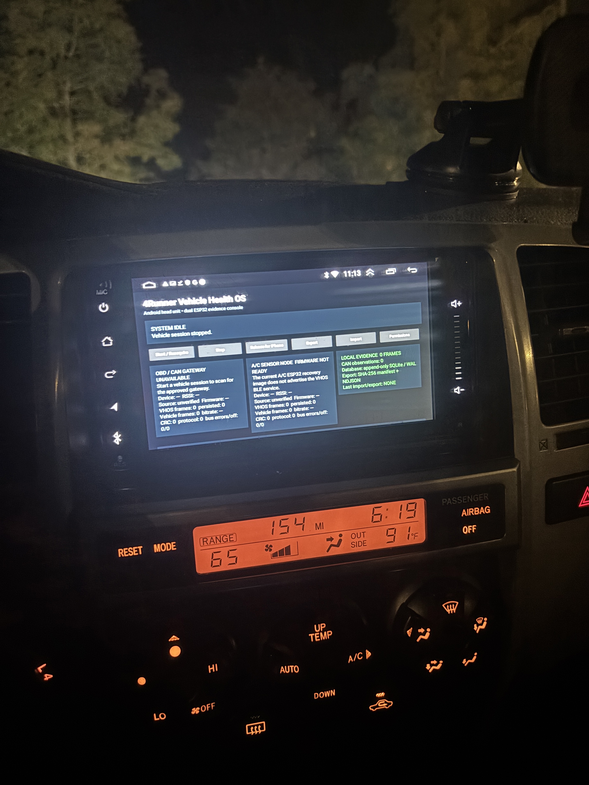

# 4Runner VHOS Android head unit

## Install on the head unit

### [DOWNLOAD VEHICLE HEALTH OS FOR ANDROID (.APK)](https://github.com/IsaiahDupree/4runner-vhos-android/releases/download/android-v0.1.0-dev.17/app-debug.apk)

Current public development build: **0.1.0-dev.17** (`app-debug.apk`, 11,457,023 bytes; SHA-256
`f70b346b7fc7cbcd79443005841b86685bf816cb0c9faea5a3b1ecbafda53824`). The link above
downloads the installer directly and does not require a GitHub account.

This release adds the vehicle-agnostic **Maintenance Garage** and **Maintenance Plan**. It stores
vehicle configuration, component lifecycles, multi-component service/repair/inspection records,
parts, fluids, measurements, costs, warranties, typed custom fields, receipts/photos, owner rules,
due-state evidence, and complete correction history in the encrypted Android truth store. CAN Units,
vendor BLE recovery, encrypted GATT validation, Discovery, replay, and fail-closed signal promotion
remain intact.

While the vehicle is parked:

1. Tap **DOWNLOAD VEHICLE HEALTH OS FOR ANDROID (.APK)** above.
2. Approve the browser download, then open `app-debug.apk` from Downloads or the notification.
3. If Android asks, allow this browser to **Install unknown apps**.
4. Tap **Install**, then **Open**.

[Open the public Release Hub](https://isaiahdupree.github.io/4runner-vhos-release-hub/) ·
[View release details and checksum](https://github.com/IsaiahDupree/4runner-vhos-android/releases/tag/android-v0.1.0-dev.17)

## Installed in the 4Runner

<p align="center">
  
</p>

The Android head-unit app running in the vehicle with its independent OBD/CAN, A/C sensor-node,
and local evidence states visible.

Native Android client for the 4Runner Vehicle Health OS. It is deliberately separate from the
[OBD/CAN firmware](https://github.com/IsaiahDupree/4runner-vhos-firmware), the
[A/C telemetry node](https://github.com/IsaiahDupree/4runner-ac-telemetry-node), and the
[iPhone/product repository](https://github.com/IsaiahDupree/4runner-vehicle-health-os), while using
their versioned transport and evidence contracts.

The first vertical slice provides:

- service-filtered BLE discovery for VHOS gateways;
- independent OBD/CAN and A/C device state;
- exact 36-byte `VHOS` frame validation with header and payload CRC32C;
- encrypted GATT notification subscription before handshake negotiation;
- append-only local storage for validated raw logical frames and CAN observations, including
  transactional materialization of CRC-valid persistent capture records;
- a vehicle-agnostic **Maintenance Garage** backed by the encrypted Android truth store: owners can
  create and revise vehicle assets; maintain physical-component lifecycle records; record service,
  repair, inspection, replacement, fluid service, and notes; capture structured providers, costs,
  parts/fluids, measurements, warranty terms, completion claims, attachments, and typed custom
  fields; search/filter the current ledger; inspect immutable revision/audit history; and void an
  incorrect record with a reason without deleting evidence;
- a fail-closed **Maintenance Plan & Applicability** workspace for append-only vehicle-configuration
  evidence, tri-state severe-use conditions, owner-custom maintenance rules, immutable rule history,
  and reproducible `UNKNOWN`/`CURRENT`/`UPCOMING`/`DUE`/`OVERDUE` projections; verified vehicle-pack
  rules are read-only and cannot be activated by an unreviewed draft source manifest;
- bounded receipt/photo/PDF attachment capture through Android's system document picker, with each
  body stored once as a SHA-256-addressed BLOB inside SQLCipher, plus deterministic encrypted
  `.vhosmaintenance` export containing the complete vehicle/component/rule/record/audit graph and
  referenced attachment bodies;
- a versioned CAN Discovery dashboard for acquisition facts, sampled coverage, raw activity,
  candidate checksum families, repeated channels, and correlations without speculative vehicle labels;
- a dedicated **CAN Units** engineering dashboard that separates current supported SAE J1979
  physical values, fresh persisted live passive-CAN candidate values, historical cross-model unit
  candidates, and raw-only channels; the live lane keeps at most 64 latest-per-identifier RAW_CAN
  observations, expires them after five seconds, excludes retained downloads and unpersisted frames,
  resets activity at every source/capture-session boundary, and reuses the exact SHA-pinned
  research-pack transforms. Every recently observed identifier is inventory-driven rather than
  allowlisted: every identifier gets an exact raw row, including IDs that also receive separate
  pinned unverified unit/formula cards. Raw rows show ID, DLC, payload, sequence, age, accepted
  observation/change counts, latest changed-byte mask, and a gateway-timeline-derived rate explicitly
  labeled **app-observed** rather than true bus arrival rate. The dashboard also exposes
  min/max/mean, standard deviation, peak-to-peak, coefficient of variation, exact field/transform
  formulas, pack/source authority, and same-session 0x2C4↔0x2D0 ratio/correlation without making
  engine, turbine, gear, slip, brake, or health claims;
- a SHA-pinned **UNVERIFIED CROSS-MODEL HYPOTHESIS** research surface that evaluates retained
  listen-only bytes while keeping production display, automatic promotion, and digital-twin writes blocked;
- a ranked **NEXT VALIDATION MISSIONS** surface that converts real target activity and source
  lineage into the next controlled experiment without treating research priority as signal confidence;
- a three-pane **DISCOVERY ENGINEERING** workspace with real persisted overview, versioned test
  library, immutable-start capture drafts, synchronized event/measurement markers, Candidate Inbox,
  closed Signal Registry, progress counts, and Replay Lab;
- a centralized engineering safety gate that requires a current validated gateway-health `PARKED`
  report, retains its source/sequence/monotonic lineage, and rejects unknown, moving, stale, future,
  degraded, speed-zero, and owner-asserted states;
- one exact `UNKNOWN`-only **Park / Selector Bootstrap** that appends P/R/N/D labels to current
  passive evidence only after gateway identity, capability, recorder state, capture session,
  health freshness, live raw-CAN freshness, and retained raw-anchor lineage all match;
- a read-only **HISTORICAL REPLAY • NOT LIVE** surface that replays persisted real CAN evidence
  through the production envelope/stream/CAN decoders at source time or full-speed ×20 load;
- self-resynchronizing frame decoding with explicit corruption, discarded-byte, and recovery
  counters plus automated fragment-loss, payload-corruption, disconnect, cancellation, and soak tests;
- an on-device **OFFLINE LINK RELIABILITY LAB • NOT LIVE** covering MTU 23/churn, bursts, stalls,
  duplicates, fragment loss/corruption/reordering, stale link epochs, reconnects, modeled
  supervision timeout, bounded queue overrun, and mixed interference against saved real evidence;
- passive SAE J1979 Mode 01 response decoding, per-ECU supported-PID continuation tracking, and
  pinned standard read-only values that remain unavailable until support is proven;
- real gateway, protocol, frame, error, and freshness indicators;
- automatic head-unit hardware/runtime/deployment inventory;
- an append-only `toyota.4runner.2005` configuration profile with a V6 timing-chain / V8
  timing-belt applicability guard;
- a 22-system whole-vehicle health map that begins entirely `UNKNOWN / UNKNOWN` and requires
  immutable evidence before showing any health state;
- non-destructive SQLCipher schema migrations through v12, including immutable
  vehicle/profile/source bindings on raw logical/CAN evidence, scoped Android-internal Discovery
  captures/markers/capability observations, fail-closed legacy quarantine, and owner-controlled
  versioned digital-twin JSON export;
- SQLCipher page encryption with a Keystore-wrapped random database passphrase, deterministic
  interrupted-migration recovery, and fail-closed evidence opening;
- direct reconnect to the last CRC-handshake-validated gateway before any scan;
- bounded API 33 BLE scans with named platform errors, exponential cooldown, and owner retry;
- recent evidence export and checksummed Android/iPhone handoff bundles;
- a connected-device foreground service for an explicitly started vehicle session; and
- a signed public Release Hub with APK hash, package, version, and signing-certificate verification
  before Android's owner-approved installer opens.

The current OBD gateway can exercise the complete BLE path. The current A/C ESP32-S3 recovery image
does not advertise BLE and will correctly remain `FIRMWARE NOT READY`; the app does not invent A/C
data while that firmware milestone is pending.

The deployed OBD firmware sends every framed response type over one encrypted multiplexed stream
characteristic. Android enables exactly that one CCCD before requesting the handshake; the separate
health and OTA characteristics remain registered for GATT compatibility but are not subscribed.

## Standard read-only OBD evidence

Firmware `0.1.0-dev.30` adds a separate, CRC-protected diagnostic-response record without replacing
the original raw CAN observation. Android persists that raw logical record before interpreting it,
groups Mode 01 supported-PID bitmaps by responding ECU, follows advertised `00/20/40/...`
continuations, and then projects only proven supported values from the pinned definition registry.
Missing, incomplete, malformed, or unsupported values remain unavailable; they are never rendered as
numeric zero.

Every standard value retains the firmware capture ID, gateway monotonic timestamp, and original CAN
source sequence. Availability state is reset when gateway, capture, or transport identity changes,
so a new drive cannot inherit a prior drive's supported-PID proof.

The current standard display covers calculated load, coolant temperature, short- and long-term fuel
trim, fuel pressure, intake pressure, engine speed, vehicle speed, ignition timing, intake-air
temperature, air flow, throttle position, and engine run time when the corresponding ECU evidence is
present. The ESP32 remains in TWAI listen-only mode and Android has no diagnostic transmit API.
During this milestone, responses are observed when an approved external client such as Toyota
Techstream issues the read-only requests.

## Maintenance Garage

Open **Maintenance Garage** from the main head-unit controls. The landscape workspace keeps the
vehicle selector and filters visible beside a maintenance timeline, current record detail, and the
record's immutable revision/audit trail. **Components** manages installed and retired physical-part
identities, while **Plan & configuration** manages configuration facts, severe-use evidence,
owner-custom requirements, and due-state explanations. It supports any make/model/year and never
assigns a 4Runner-specific service schedule to a generic vehicle.

Android is the canonical local writer. **Edit vehicle** appends a vehicle-asset revision; **Amend**
appends a maintenance-record revision and requires a reason; **Void** appends a void revision and
preserves the original. An empty timeline means unrecorded/unknown—not healthy and not current.
The iPhone companion should consume accepted Android records and audit receipts instead of becoming
a second independent source of maintenance truth.

All maintenance truth is stored app-private in the existing `vhos-evidence.db` SQLCipher database;
its random passphrase is wrapped by Android Keystore. Receipt, photograph, PDF, and other selected
document bytes are content-addressed in the `maintenance_attachment_blobs` SQLCipher table—not in a
plaintext filesystem object directory. The UI can export one vehicle as a deterministic,
checksummed `.vhosmaintenance` archive through Android's system document provider. The archive
reader and integrity checks exist, but transactional archive import/restore is not yet exposed in
the Garage UI.

The official Toyota 2005 scheduled-maintenance source receipt and draft manifest remain deliberately
inactive. Until every chart and footnote is normalized, configuration/severe-use applicability is
complete, independent review is recorded, and a trusted pack is activated against the exact vehicle
revision, Toyota-derived requirements cannot produce a due state. Owners may create clearly labeled
`OWNER_CUSTOM` rules in the meantime; missing applicability or baseline evidence remains `UNKNOWN`.

The persistence, archive, and UI paths have automated coverage. The remaining deployment acceptance
work is a physical head-unit run of the system document picker/export flow and a complete
transactional archive restore UI; neither is represented as complete by the app.

See [docs/MAINTENANCE-GARAGE.md](docs/MAINTENANCE-GARAGE.md) for the UI workflow and evidence
boundaries and [docs/MAINTENANCE-DATA-ARCHITECTURE.md](docs/MAINTENANCE-DATA-ARCHITECTURE.md) for
the encrypted schema, revision semantics, rule authority, and portability contract.

The synchronized Toyota-reference procedure and private iPhone evidence-outbox contract are recorded
in the product repository's
[J1979/reference/outbox implementation record](https://github.com/IsaiahDupree/4runner-vehicle-health-os/blob/agent/ios-hardware-foundation/docs/development/J1979-REFERENCE-VALIDATION-AND-PRIVATE-OUTBOX-2026-08-18.md).

## Build

```bash
export JAVA_HOME=/opt/homebrew/opt/openjdk@17/libexec/openjdk.jdk/Contents/Home
export ANDROID_SDK_ROOT="$HOME/Library/Android/sdk"
./gradlew test lint assembleDebug
```

The debug APK is written to `app/build/outputs/apk/debug/app-debug.apk`.

## Repository relationships

See [docs/ARCHITECTURE.md](docs/ARCHITECTURE.md) for ownership boundaries and
[docs/DEVICE-CONNECTION-CONTRACTS.md](docs/DEVICE-CONNECTION-CONTRACTS.md) for the exact devices and
services the app accepts. The one-trip vehicle test is in
[docs/HEAD-UNIT-COMMISSIONING.md](docs/HEAD-UNIT-COMMISSIONING.md).
The installed Android 13 recovery state machine is documented in
[docs/API33-BLE-RECOVERY.md](docs/API33-BLE-RECOVERY.md).
The evidence interpretation boundary and current 5,176-record baseline are documented in
[docs/CAN-DISCOVERY-DASHBOARD.md](docs/CAN-DISCOVERY-DASHBOARD.md).
The exact Toyota research-pack hash, fail-closed parser, current candidate lineage, and promotion
gate are documented in
[docs/SIGNAL-HYPOTHESIS-RESEARCH-SURFACE.md](docs/SIGNAL-HYPOTHESIS-RESEARCH-SURFACE.md).
The device-free production-path replay controls, fault matrix, and hardware boundary are documented
in [docs/REAL-CAN-OFFLINE-REPLAY.md](docs/REAL-CAN-OFFLINE-REPLAY.md).
The harsher 15-scenario communication matrix, exact budgets, UI result semantics, recovery-loop
fix, and remaining hardware-in-loop gate are documented in
[docs/LINK-RELIABILITY-LAB.md](docs/LINK-RELIABILITY-LAB.md).
The whole-vehicle model, evidence-basis rules, variant guard, and current implementation boundary
are documented in
[docs/WHOLE-VEHICLE-DIGITAL-TWIN.md](docs/WHOLE-VEHICLE-DIGITAL-TWIN.md).
The encrypted local truth store, exact plaintext migration and recovery state machine, and remaining
physical-device acceptance gate are documented in
[docs/ENCRYPTED-EVIDENCE-STORE.md](docs/ENCRYPTED-EVIDENCE-STORE.md).
The first Android Discovery workspace, deterministic PARKED gate, SQLCipher draft/marker lifecycle,
candidate authority, replay boundary, and portable-contract mapping boundary are documented in
[docs/DISCOVERY-ENGINEERING-WORKSPACE.md](docs/DISCOVERY-ENGINEERING-WORKSPACE.md).
The exact UNKNOWN-only Park/selector bootstrap, live capture-lineage gate, persistence extension,
vehicle procedure, and explicit non-authority boundary are documented in
[docs/PARK-SELECTOR-BOOTSTRAP.md](docs/PARK-SELECTOR-BOOTSTRAP.md).
